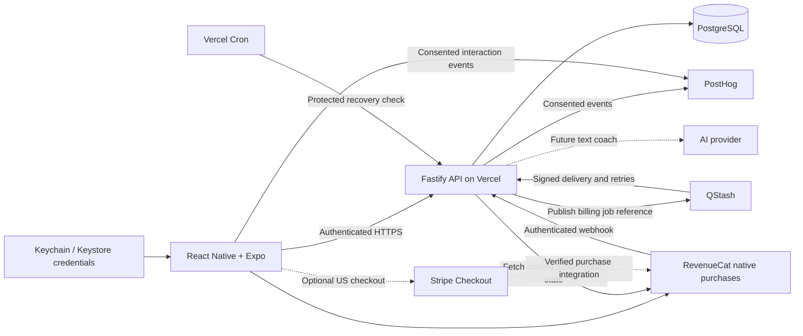

# JustGO — Cloud Tech Stack Specification

**Date:** September 16, 2026  
**Status:** Architecture spec; phase 01 foundation is implemented and verified, including native simulator launch and staging readiness. Exact versions, environment and operations: [FOUNDATION.md](FOUNDATION.md); evidence: [phase 01 handoff](handoffs/phase-01-foundation.md).  
**Implementation plan:** [Stages and handoffs](IMPLEMENTATION_PLAN.html).  
**Platforms:** iOS first; shared React Native codebase, with Android implementation/release deferred.  
**Core decision:** React Native + Expo + TypeScript, a TypeScript API, and managed PostgreSQL. App data lives in PostgreSQL. Users enter without signup, email, SMS, or OAuth.

## 1. Requirements and decisions

This is a fresh specification based on the current request and the product discussion in [TechStack&Architecture](thread://019fc40c-2517-7693-a477-5290a4cc3eb7?hostId=local). Previous project documents are not requirements for this spec.

The first iOS release includes onboarding, a hard paywall, one collection of general easy Level 1 challenges, timed attempts, completion, feelings and typed reflections, the full progress summary/calendar/day sheet, and scoped settings. The [PRD](PRD.md) owns release scope and the five feeling choices; the [implementation plan](IMPLEMENTATION_PLAN.md) owns sequencing. Levels/progression, venue/category filters, custom dictation, lock-screen display, Android release, and the text coach are deferred. Preserve stable content/attempt history now; decide progression thresholds and prior-credit treatment later.

| Decision                                                              | Status                                                                                                           |
| --------------------------------------------------------------------- | ---------------------------------------------------------------------------------------------------------------- |
| React Native, Expo, TypeScript                                        | Required                                                                                                         |
| Server database is the source of truth                                | Required; PostgreSQL recommended                                                                                 |
| API hosting                                                           | Vercel Functions running the Fastify API                                                                         |
| Shared onboarding state                                               | Zustand in memory; save and restore onboarding progress through the API                                          |
| Reflection input                                                      | Typed private text at launch; custom dictation and its native dependency/permissions deferred                    |
| AI text coach                                                         | Planned later in the same API and database; no voice coach in scope                                              |
| Background processing                                                 | QStash for managed subscription-update delivery and retries from launch; job handlers run on Vercel              |
| Billing recovery                                                      | Scheduled handoff repair and provider reconciliation from launch; QStash does not replace these checks           |
| Challenge timer                                                       | Original deadline survives lock/background/relaunch; in-app display at launch, lock-screen display deferred      |
| Content / future progression                                          | Stable Level 1 context at launch; no level thresholds, unlocking, or skipping yet. No completed-challenge replay |
| No signup/login screen or OAuth requirement                           | Required                                                                                                         |
| Automatic recognition using securely stored credentials               | Required                                                                                                         |
| Recovery on another iPhone through synchronizing Keychain credentials | Core feature, conditional on platform availability; requires a native implementation and device testing          |
| Native purchases through RevenueCat                                   | Initial payment path                                                                                             |
| Stripe web checkout for eligible US iOS storefront users              | Optional phase; designed into billing boundaries, disabled initially                                             |
| Local database/offline synchronization engine                         | Not part of this architecture                                                                                    |

The Moonly example informs the frictionless experience. Its reported user count and doubled LTV are not treated as verified facts or forecasts for JustGO.

## 2. Recommended stack

### Mobile application

| Layer                          | Technology                                                                                           | Why it belongs                                                                                   |
| ------------------------------ | ---------------------------------------------------------------------------------------------------- | ------------------------------------------------------------------------------------------------ |
| Application                    | React Native + Expo + TypeScript strict mode                                                         | Shared mobile implementation using React skills and Fast Refresh                                 |
| Native runtime                 | Expo development builds, `expo-dev-client`, Continuous Native Generation                             | Purchases and Keychain recovery need the actual native application                               |
| Navigation                     | Expo Router                                                                                          | Onboarding, paywall, tabs, focused challenge flow, settings, and payment-return links            |
| UI styling                     | React Native `StyleSheet` + typed design tokens                                                      | Precise custom screens without adopting a second styling/UI framework                            |
| Gesture recognition            | `react-native-gesture-handler`                                                                       | Detect dragging, release velocity, and competing gestures                                        |
| Motion                         | `react-native-reanimated` + compatible `react-native-worklets`                                       | Move and rotate cards on the UI thread; animate transitions and reduced-motion alternatives      |
| Artwork/fonts                  | `react-native-svg`, `expo-image`, `expo-font`                                                        | Crisp vector art, efficient images, and consistent licensed fonts                                |
| Detail sheets                  | `@gorhom/bottom-sheet`                                                                               | Scrollable day-detail sheets; validate the chosen dependency versions together                   |
| Insets/native navigation       | `react-native-safe-area-context`, Router dependencies                                                | Safe areas and platform navigation behavior                                                      |
| Server state                   | TanStack Query                                                                                       | Fetching, in-memory caching, invalidation, optimistic display, and request status                |
| Shared onboarding state        | Zustand, without persistence middleware                                                              | Answers and unsaved edits shared across onboarding screens; PostgreSQL owns saved progress       |
| Screen-local UI state          | React hooks/context; Reanimated shared values for gestures                                           | Selected month, sheet visibility, local inputs, and animation state                              |
| Validation                     | Zod                                                                                                  | Runtime API/input validation and shared TypeScript contracts                                     |
| Session secrets                | `expo-secure-store`                                                                                  | Per-device credentials protected by iOS Keychain/Android Keystore                                |
| iPhone recovery                | Small local Expo native module using Swift Keychain APIs                                             | Explicit support for synchronizable recovery credentials; separate from ordinary session storage |
| Haptics/reminders              | `expo-haptics`, `expo-notifications`                                                                 | Tactile feedback and locally scheduled reminders                                                 |
| Deferred lock-screen countdown | Candidate iOS Live Activities through `expo-widgets`; separate Android adapter when Android is built | Revalidate native support when scheduled; not an initial dependency or launch gate               |
| Deferred custom dictation      | Candidate `expo-speech-recognition`, behind an adapter                                               | Select/install and validate only when the feature is scheduled                                   |
| Future coach transport         | Streaming HTTPS response consumed with `expo/fetch`                                                  | Display the text coach's answer as it arrives; validate on real iOS/Android development builds   |
| Diagnostics                    | `@sentry/react-native`                                                                               | Scrubbed crash and performance reporting                                                         |

Use the stable Expo SDK and its matching React/React Native versions. Install compatible native packages through `expo install`, pin the resolved versions, commit a lockfile, and run Expo Doctor. Record the exact version matrix and minimum OS versions during scaffolding rather than independently choosing the latest of each package. [Expo compatibility reference](https://docs.expo.dev/versions/latest/).

Reanimated 4 requires the New Architecture and a compatible Worklets release. Check the matrix, including the sheet library, before committing the native dependency set. [Reanimated compatibility](https://docs.swmansion.com/react-native-reanimated/docs/guides/compatibility/).

Expo development builds support normal TS/TSX Fast Refresh while including custom native code. Changes to native modules/configuration require a new binary. Expo Go previews are insufficient to validate real purchases or custom recovery behavior. [Development builds](https://docs.expo.dev/develop/development-builds/introduction/), [RevenueCat Expo integration](https://www.revenuecat.com/docs/getting-started/installation/expo).

### Backend and operations

| Layer                     | Technology                                                                           | Why it belongs                                                                                                |
| ------------------------- | ------------------------------------------------------------------------------------ | ------------------------------------------------------------------------------------------------------------- |
| API                       | Node.js LTS + Fastify + TypeScript                                                   | One explicit backend for credential verification, account recovery, domain transactions, and billing          |
| Database                  | PostgreSQL hosted by Supabase                                                        | Managed relational database; standard PostgreSQL schema and SQL                                               |
| Data access               | Drizzle ORM + `pg`                                                                   | Typed server queries, PostgreSQL transactions, and migration generation                                       |
| API contracts             | Zod + OpenAPI                                                                        | Validated requests/responses shared with the app; explicit HTTP contract                                      |
| API hosting               | Vercel Functions, Node.js runtime with Fluid compute                                 | Existing familiar hosting platform; supports Fastify and streaming responses; place compute near the database |
| Authentication            | Server-issued opaque device sessions + high-entropy recovery credentials             | No visible signup; recovery does not depend on an email or a shared rotating refresh token                    |
| Payments                  | RevenueCat React Native SDK + UI SDK                                                 | Native iOS StoreKit purchases and paywalls at launch; Google Play integration when Android is scheduled       |
| Optional web payments     | Stripe Checkout + Stripe Billing, integrated with RevenueCat                         | Hosted US iOS app-to-web checkout without building card-entry UI                                              |
| Analytics                 | PostHog                                                                              | Explicit product events, funnels, retention, cohorts, and experiments                                         |
| Server diagnostics        | Sentry + structured redacted logs                                                    | Backend failures, latency, request IDs; no secret or journal payload logging                                  |
| Background jobs           | Upstash QStash + `@upstash/qstash`                                                   | Managed HTTP delivery, retries, and concurrency controls; signed calls execute our job handlers on Vercel     |
| Billing recovery schedule | Vercel Cron calling a protected API endpoint                                         | Repair failed job handoffs and enqueue reconciliation of potentially stale provider state                     |
| Future text coach         | AI provider API behind a server-side adapter; provider/model chosen when implemented | Reuse account, billing, and data access; stream answers and enforce context permissions and usage limits      |
| Asset storage             | Bundled art initially; object storage when remote media is needed                    | Keep binary assets out of relational rows                                                                     |
| CI/release                | GitHub Actions + EAS Build/Submit/Update                                             | Checks, mobile builds, store distribution, compatible JS/asset updates                                        |

Fastify is a Node framework, and Drizzle uses `pg` to access PostgreSQL. Deploy the Fastify application to Vercel Functions using its supported Node entrypoint. Keep one backend application with feature modules and a hosting adapter. [Fastify](https://fastify.dev/docs/latest/), [Drizzle PostgreSQL](https://orm.drizzle.team/docs/get-started-postgresql), [Fastify on Vercel](https://vercel.com/docs/frameworks/backend/fastify).

Vercel hosts the API; the mobile frontend is distributed through the app stores using EAS. API function instances are replaceable: keep durable state in PostgreSQL and do not run an in-process queue or recurring timer. Configure request timeouts, payload bounds, and streaming duration within the deployed plan's limits; a streamed request still has a maximum execution time. Recheck those limits during scaffolding. [Vercel Function limits](https://vercel.com/docs/functions/limitations).

**Supabase is the database host in this design.** The app calls our API; it does not access PostgreSQL tables directly. Do not add Supabase Auth alongside the custom credential/session system. Its anonymous sign-in feature is useful, but by itself does not solve credential recovery on another device. [Supabase anonymous sign-ins](https://supabase.com/docs/guides/auth/auth-anonymous).

The small custom identity service adds security-sensitive work. That work is justified by the required no-signup recovery behavior and must receive focused testing/review before launch. It uses standard random bearer credentials and server sessions, not an invented encryption algorithm.

Use Supabase's transaction pooler for the serverless runtime and a small, reused `pg` pool per function instance. Budget connections across concurrent API and job instances; automatic API scaling does not increase database capacity. Avoid named prepared statements with transaction pooling. Use a separate compatible connection for migrations, keep user context transaction-local, and end database transactions before waiting for RevenueCat or an AI response. [Supabase connection modes](https://supabase.com/docs/guides/database/connecting-to-postgres).

## 3. Architecture and storage boundaries



| Data                                                                                   | Permanent location                                                                                          |
| -------------------------------------------------------------------------------------- | ----------------------------------------------------------------------------------------------------------- |
| Anonymous app account, onboarding answers/schema version/last completed step, settings | PostgreSQL                                                                                                  |
| Challenges, revisions, stable Level 1 metadata                                         | PostgreSQL; progression requirements added when levels are implemented                                      |
| Active attempt, countdown deadline, completion/give-up                                 | PostgreSQL                                                                                                  |
| Feelings, reflection drafts/saved text, progress, history                              | PostgreSQL                                                                                                  |
| Billing mappings and verified entitlement projection                                   | PostgreSQL; billing provider remains authoritative                                                          |
| Billing event processing and dispatch status                                           | PostgreSQL; QStash temporarily retains job references and delivery history according to its configured plan |
| Recovery/session credentials                                                           | Keychain/Keystore; only hashes and metadata in PostgreSQL                                                   |
| Optional analytics events                                                              | PostHog, derived through controlled instrumentation                                                         |
| Future coach conversations/messages and AI usage records                               | PostgreSQL when coaching is implemented; minimum permitted context sent to the AI provider                  |

Keychain remembers how to authenticate; PostgreSQL remembers the user's app state. Cloud storage of a reflection is part of the requested app functionality. Sending that reflection or derived measurements to an analytics vendor is a separate decision.

There is no SQLite database, durable offline mutation queue, or local-first sync layer. In-memory screen data and ordinary image caching are implementation details, not a second source of truth. Do not persist the entire query cache containing private journal data.

**Network behavior:** account bootstrap, loading uncached history, starting an attempt, completing it, and saving a reflection require the API. A previously loaded countdown can continue rendering during a connection loss, but a save is only confirmed after the server accepts it. Keep unsaved input visible with retry status; autosave drafts to PostgreSQL when connected. Without local draft persistence, force-quitting while offline can lose unsaved input. The UI must distinguish unsaved, saving, saved, and failed states.

### Onboarding: state, saving, and restoration

Expo Router owns navigation, Zustand holds shared in-memory answers/unsaved edits, and TanStack Query performs API reads and mutations. PostgreSQL owns saved answers, onboarding schema version, last completed step, completion timestamp, and edit revision. Keep screen-local state in React and gesture state in Reanimated; do not copy the entire query cache into Zustand. [Zustand](https://github.com/pmndrs/zustand).

After account recovery/bootstrap, load saved onboarding progress and hydrate the store once for that account/version. Save validated answers and the completed step together after each step; advance only after the server confirms the save. A failed save keeps the answers visible with retry status. Editing an earlier answer must revalidate any dependent steps. Refreshes must not overwrite dirty in-memory answers; resolve revision conflicts explicitly. Clear the onboarding store and query data on account changes/deletion, and reset temporary onboarding state after completion.

Do not enable Zustand `persist` or store onboarding answers in AsyncStorage. Relaunch resumes from the server's last confirmed step. Unsaved offline changes can be lost on force-quit, consistent with the cloud persistence decision.

## 4. Frictionless identity and recovery

### User experience

The first launch has no account form. The app discovers or creates a secure credential, obtains a backend session, and loads the associated account. On a supported reinstall/new-device path, the same credential finds the existing PostgreSQL account and restores its data.

“Anonymous account” means an account without required identifying contact information. It is still authenticated and persistent. A public UUID, advertising identifier, device model, or RevenueCat customer ID is never sufficient to read someone's journal.

### Concrete credential design

Use two separate credential classes:

| Credential          | Purpose                                             | Storage/lifecycle                                                                                                         |
| ------------------- | --------------------------------------------------- | ------------------------------------------------------------------------------------------------------------------------- |
| Recovery credential | Proves ownership when installing/recovering the app | At least 256 bits of cryptographic randomness; synchronizable Keychain item on iOS; long-lived but revocable              |
| Device session      | Authorizes ordinary API calls                       | Independent random opaque token per installation/session, stored in non-synchronizing secure storage; expires and rotates |

The server stores a one-way digest of each high-entropy secret, its user binding, expiry/revocation state, and minimal audit metadata. Compare/validate safely, rate-limit bootstrap/recovery, and scrub credentials from logs, analytics, URLs, and crash reports. Use operating-system/Node cryptographic primitives.

Bootstrap/recovery sequence:

1. Read available recovery credentials before creating anything. A locked/unavailable Keychain is an error/retry state, not proof that the user is new.
2. If a credential exists, present it over TLS to the recovery endpoint. The backend verifies it and creates a fresh device session for the existing account.
3. If none exists, generate and successfully store a credential before creating the cloud account. Bootstrap is idempotent on the credential digest, so retrying a lost response does not create a duplicate account.
4. Download settings, active attempt, journal, progress, and verified billing state from PostgreSQL.
5. Revoke device sessions separately from recovery credentials. Account deletion revokes both. Previously revoked/deleted credentials must not bootstrap a resurrected account.

Do not synchronize a rotating device refresh/session token across multiple phones. Each recovered device gets its own session, so one phone's renewal does not invalidate another's token.

### What Apple Keychain can and cannot do

Ordinary iOS Keychain entries may survive app reinstallation, but this is not an unconditional recovery guarantee. Android SecureStore data is removed on uninstall. Expo explicitly warns against relying on secure-store persistence as the only recovery mechanism. [Expo SecureStore](https://docs.expo.dev/versions/latest/sdk/securestore/).

For a different iPhone, explicitly store the recovery item with Apple's `kSecAttrSynchronizable` behavior and a compatible accessibility class, under the app's correct access group. `ThisDeviceOnly` attributes cannot be used for an item intended to synchronize. Access-group continuity and supported device configuration must be tested. [Apple synchronizable Keychain items](https://developer.apple.com/documentation/security/ksecattrsynchronizable).

The user needs the appropriate Apple Account/iCloud Passwords & Keychain setup on their approved devices, and synchronization may be delayed or unavailable. This uses the OS account already configured on the phone; it does not introduce Sign in with Apple inside JustGO. [Apple iCloud Keychain setup](https://support.apple.com/en-us/109016).

Implement explicit synchronizable-item handling in a small Expo native module. Do not assume `expo-secure-store` exposes this behavior just because it uses Keychain. Most application code remains TypeScript; this narrow capability uses Swift. [Expo Modules API](https://docs.expo.dev/modules/overview/).

### Recovery matrix and fallback

The iPhone cases and a usable recovery fallback are first-release requirements. Android/cross-platform cases below describe future validation, not iOS launch gates.

| Situation                                                            | Expected behavior                                                                                  |
| -------------------------------------------------------------------- | -------------------------------------------------------------------------------------------------- |
| Relaunch/update on the same installation                             | Use the existing device session or silently recover it                                             |
| Reinstall on the same iPhone with credential retained                | Authenticate with the retained recovery credential and reload cloud state                          |
| Another iPhone with synchronized credential available                | Mint a separate device session for the same account; reload cloud state                            |
| iCloud sync unavailable, different Apple Account, or erased Keychain | Automatic recovery is not guaranteed; use a recovery key or existing-device transfer               |
| Android reinstall or a move between iOS and Android                  | Use explicit recovery key/device transfer; no assumed iCloud/Keystore equivalence                  |
| All credentials and recovery methods lost                            | The backend cannot safely infer ownership; do not expose history based on a purchase or guessed ID |

Provide optional **Save recovery key** and **Transfer to another device** actions in Settings without making them onboarding prerequisites. Recovery keys are independently generated/revocable; transfer uses a short-lived, one-use code approved by an existing authenticated device. They do not require email, SMS, or OAuth.

Handle delayed iCloud delivery without overwriting an older credential or silently merging accounts. Preserve discovered credentials; if a new empty account was created and an old credential later arrives, recover deliberately. Merging two nonempty histories or billing identities needs proof of both and an explicit flow. Test fresh installs on two devices before claiming seamless cross-device recovery.

## 5. Why PostgreSQL is the right database

JustGO has connected entities and transactional rules. A level has challenges; users accept challenges as individual attempts; each attempt can have feelings and a reflection; paid access can originate from different billing providers. These are naturally relational.

| Requirement                                                                    | PostgreSQL                                         | MongoDB assessment                                                                    |
| ------------------------------------------------------------------------------ | -------------------------------------------------- | ------------------------------------------------------------------------------------- |
| Shared levels/challenges and per-user attempts                                 | Foreign keys and joins                             | References still needed; embedding all content/history into each user duplicates data |
| Complete an attempt once; future progression                                   | Transactions, row locks, unique constraints        | Possible with transactions, but not a simpler model here                              |
| Compare feelings, reflection length, next actions, retention                   | SQL grouping/window functions and joins            | Aggregation pipelines can work, but fit these relationships less directly             |
| Evolving question/content metadata                                             | Typed core fields plus `jsonb` where useful        | Flexible documents are useful, but do not provide a decisive advantage                |
| Unbounded journal/attempt history                                              | Separate indexed rows with pagination              | Avoid ever-growing arrays in a single user document                                   |
| Unified subscriptions and webhook deduplication                                | Explicit provider identifiers and uniqueness rules | Feasible, with no clear benefit over PostgreSQL                                       |
| Future coach context from reflections, challenge types, and completion history | User-scoped joins and bounded aggregate queries    | Feasible, but connected context reinforces the relational model                       |

MongoDB is capable of this app, including transactions. It becomes more attractive when most data consists of independent nested documents read and updated as complete units. That is not the dominant access pattern here. [MongoDB modeling guidance](https://www.mongodb.com/docs/manual/data-modeling/schema-design-process/map-relationships/).

PostgreSQL `jsonb` provides flexibility for bounded metadata without sacrificing a relational model. Do not put the whole user, journal, or subscription state in one JSON column. [PostgreSQL JSON types](https://www.postgresql.org/docs/current/datatype-json.html).

## 6. Proposed PostgreSQL data models

These are logical table specifications, not migrations. Use UUID primary keys for independent entities, and the parent/composite keys specified below for records identified by existing relationships. Use UTC `timestamptz` values, foreign keys, explicit nullability, and named constraints. User IDs in requests are derived from verified sessions rather than trusted request-body values.

### ID generation

- **Database-generated UUIDs by default:** For records with an independent UUID `id`, configure `id uuid PRIMARY KEY DEFAULT gen_random_uuid()` in the migration, except for the attempt rule below. Routine backend inserts omit the ID and retrieve the generated value from PostgreSQL. Backend code does not need to generate these UUIDs separately. The default generates the value; the primary key enforces uniqueness and non-nullability. [PostgreSQL UUID generation](https://www.postgresql.org/docs/current/functions-uuid.html).
- **Phone-generated attempt IDs:** The React Native app generates a random UUID once per intended start action, before sending the request, and reuses it for every retry of that action. The API requires this ID and inserts it as `attempts.id`; do not configure a database default for that column or silently generate a replacement when the request omits it. PostgreSQL still enforces the primary key. The ownership, matching-input, and retry behavior in section 7 applies.
- **Existing identifiers stay existing identifiers:** Foreign keys such as `user_id` and `attempt_id` reference existing records; they do not get new random defaults. Records keyed by a parent ID or a combination of fields do not need an additional generated ID solely to follow this convention. Provider event IDs and request keys retain their separate provider/retry contracts.

### Identity and preferences

| Table                  | Main fields                                                                                                            | Relationship/rule                                                                                    |
| ---------------------- | ---------------------------------------------------------------------------------------------------------------------- | ---------------------------------------------------------------------------------------------------- |
| `users`                | `id`, `created_at`, `status`                                                                                           | Pseudonymous account; no required name, email, or phone                                              |
| `onboarding_progress`  | `user_id`, schema version, bounded validated answers, last completed step, `completed_at`, `updated_at`, edit revision | One current record per user; answers and step saved atomically; migrate/validate versions explicitly |
| `recovery_credentials` | `id`, `user_id`, `secret_digest`, `kind`, `created_at`, `revoked_at`                                                   | One user can have Keychain and optional recovery-key credentials; unique digest                      |
| `devices`              | `id`, `user_id`, `platform`, `created_at`, `last_seen_at`                                                              | Random installation identity, not hardware fingerprint                                               |
| `device_sessions`      | `id`, `device_id`, `user_id`, `token_digest`, `expires_at`, `revoked_at`                                               | Multiple independent sessions; unique digest; device/owner consistency enforced                      |
| `user_settings`        | `user_id`, reminder time/zone, haptics, motion preference, `version`                                                   | One per user; local OS permissions still checked independently                                       |
| `consent_changes`      | `id`, `user_id`, scope/version, enabled, server timestamp                                                              | Separate analytics choices from future permission to use personal history in AI coaching             |

Optional transfer records store hashed one-use codes, issuing user/session, expiration, redemption state, and confirmation state. A server account's existence does not depend on enabling analytics.

### Content and activity

| Table                                                              | Main fields                                                                                                                                                                               | Relationship/rule                                                                                                                                                           |
| ------------------------------------------------------------------ | ----------------------------------------------------------------------------------------------------------------------------------------------------------------------------------------- | --------------------------------------------------------------------------------------------------------------------------------------------------------------------------- |
| `levels`                                                           | Stable `id`, name, order, content version                                                                                                                                                 | Seed Level 1 only; no completion requirement or progression evaluation at launch                                                                                            |
| `challenges`                                                       | `id`, status, current revision                                                                                                                                                            | Stable challenge identity                                                                                                                                                   |
| `challenge_revisions`                                              | `challenge_id`, `revision`, `level_id`, instruction, optional helper, duration, `venue_scope`, illustration key                                                                           | Immutable published revisions; composite unique key                                                                                                                         |
| `challenge_categories`, `challenge_revision_categories` — deferred | Stable category ID/key/label and revision links if needed                                                                                                                                 | Add with actual classification/filter requirements; not initial migrations                                                                                                  |
| `attempts`                                                         | Client-generated UUID `id`, `user_id`, creation-request digest, challenge/revision, level, `started_at`, `deadline_at`, outcome, `ended_at`, `completed_local_date`, time zone, `version` | Created on acceptance; reuse ID for request retries; preserve separate attempt history; at most one active attempt per user, including while awaiting an outcome after zero |
| `attempt_feedback`                                                 | `attempt_id`, `user_id`, question schema/version, after-feeling option, submitted timestamp, revision                                                                                     | One current answer set per attempt; owner must match the parent                                                                                                             |
| `reflections`                                                      | `attempt_id`, `user_id`, body, draft/saved status, input method, created/updated timestamps, revision                                                                                     | Optional private cloud text; separate from whether the attempt was completed                                                                                                |
| `level_progress` — deferred                                        | `user_id`, `level_id`, requirement snapshot, distinct qualifying challenge count, skipped/completed timestamps, version                                                                   | Unique user/level; counts updated transactionally and rebuildable from earned-credit events                                                                                 |
| `progression_events` — deferred                                    | `id`, `user_id`, level, action, source attempt, stable challenge ID, occurred timestamp                                                                                                   | Preserve earned credit, skip, revisit, and selection decisions; credit events unique per source attempt and per user/level/challenge                                        |
| `activity_sessions`                                                | `id`, `user_id`, foreground/last-active timestamps, app version/platform                                                                                                                  | Optional analytics collection only; distinguish app opens from challenge completions                                                                                        |

Initial schema scope is deliberately small: a stable Level 1 row, challenge revisions linked to it, and attempts preserving that link. Do not create `level_progress`, `progression_events`, `users.active_level_id`, course/group joins, or thresholds until their behavior is designed. If a requirement column is retained in scaffolding, it must be nullable/unset and unevaluated, not an invented zero or one-completion threshold.

Set `venue_scope` explicitly to `unrestricted` on launch revisions. Distinguish this from `unclassified` content; a missing venue link must not ambiguously mean both. Add venue/category tables and links through additive migrations when actual filters are designed. General challenges need no venue joins today. Courses/tracks are also later schema additions, not implied by PostgreSQL.

Keep challenges separate from attempts: a challenge is published content; an attempt is a user's accepted activity and its outcome. The initial release has no “Practice again” action and excludes previously completed challenges from new offers, including new revisions of the same challenge. Historical attempts and attempts ended by giving up still need their own records. Retrying a network request is the same attempt, not a product replay.

At launch, completing an attempt records its outcome and contributes one rep to activity aggregates; no level credit or advancement is computed. The stable challenge/revision/Level 1 context allows future progression to assess earlier distinct completions without rewriting history. Decide eligibility for historical credit, thresholds, skipping and selection when that feature is scheduled. Future configured pools should exceed their distinct-completion requirements; the launch catalog has no such threshold. Catalog exhaustion is not level completion.

Store the exact challenge revision and level context used for an attempt so an editorial update cannot rewrite history. Use typed nullable feedback values and distinguish missing/skipped answers from low or negative feelings. Only store before/after metrics if the UI actually asks both questions.

Reflection text lives in PostgreSQL as requested, protected by authenticated access, encrypted transport/storage, and restricted operational access. It is not sent to PostHog or Sentry. Compute coarse text-length metadata without exporting its contents. Server encryption at rest is not a claim of end-to-end encryption.

### Payments and reliable processing

| Table                            | Main fields                                                                                                                                                                                                                                                            | Relationship/rule                                                                                                                                |
| -------------------------------- | ---------------------------------------------------------------------------------------------------------------------------------------------------------------------------------------------------------------------------------------------------------------------- | ------------------------------------------------------------------------------------------------------------------------------------------------ |
| `billing_customers`              | `user_id`, RevenueCat ID, optional Stripe customer ID, last/next verification timestamps, verification dispatch status/message ID, refresh claim token/generation/expiry                                                                                               | Unique provider bindings created before purchase; supports reconciliation even when no webhook was recorded and coordinates concurrent refreshes |
| `subscriptions`                  | `id`, `user_id`, provider, provider subscription/transaction ID, product, status, period end, environment                                                                                                                                                              | Preserve separate Apple/Google/Stripe subscriptions; never collapse them into one boolean                                                        |
| `entitlements`                   | `user_id`, entitlement key, active/expiry, verification timestamp                                                                                                                                                                                                      | Rebuildable projection of verified RevenueCat state used by API guards                                                                           |
| `billing_events`                 | provider, provider event ID, environment, customer reference, allowlisted replay data, received/processed timestamps, processing status, processing attempt count, dispatch status/claim expiry, QStash message ID, last/next dispatch timestamps, redacted error code | Unique provider/event ID; durable receipt and business outcome; dispatch fields recover failed or uncertain QStash handoffs                      |
| `idempotency_records` — optional | `user_id`, endpoint, request key, payload digest, stored result                                                                                                                                                                                                        | Add only when existing records cannot identify an action or preserve its required retry result; same key with a different payload is rejected    |
| `checkout_sessions` — optional   | `id`, `user_id`, provider session ID, approved price, status, expiry                                                                                                                                                                                                   | Bind web checkout to the authenticated app account without asking the browser to log in                                                          |

Safe retries are required; a separate table of request receipts is not. Initially, use the attempt ID for creation retries, attempt state and completion constraints for completion, and provider event IDs in `billing_events` for duplicate notifications. Reuse backend retry-handling logic across applicable operations. Do not create `idempotency_records` until an operation requires it, and do not record every API request there.

QStash is selected for billing jobs. `billing_events` is the durable billing receipt and handoff record; QStash manages delivery attempts, while PostgreSQL records whether the business update succeeded. A generic `outbox_jobs` table, Redis service, Celery installation, and continuously running worker server are not required. Other features can reuse QStash when they have a concrete deferred-work requirement (section 7).

### Future text coach — add tables when the feature is implemented

| Table                 | Main fields                                                                                                                                                                               | Relationship/rule                                                                                                           |
| --------------------- | ----------------------------------------------------------------------------------------------------------------------------------------------------------------------------------------- | --------------------------------------------------------------------------------------------------------------------------- |
| `coach_conversations` | `id`, `user_id`, created/updated timestamps, status                                                                                                                                       | User-owned conversation; paginated history and authenticated deletion                                                       |
| `coach_messages`      | `id`, `conversation_id`, `user_id`, role, body, sequence, created timestamp, response status                                                                                              | Enforce parent/owner consistency and unique conversation sequence; distinguish complete, interrupted, and failed responses  |
| `coach_requests`      | `id`, `user_id`, `conversation_id`, client request key, user/assistant message IDs, status, expiry, provider request ID, prompt/context-policy version, model, usage/reservation metadata | Unique user/request key; reject reuse with a different payload; track concurrent work, actual usage, and uncertain outcomes |

Keep conversation history in separate rows, not one growing JSON array. Index owner/conversation access and message pagination when coaching is built. Reuse `consent_changes` for coaching context choices. Raw prompts and reflection text do not belong in usage logs. These are planned models, not initial migrations.

### Indexes and query performance

Define primary keys and uniqueness rules with the schema. PostgreSQL creates indexes for primary-key and unique constraints; do not duplicate them. Additional indexes are lookup structures for particular filters, joins, ordering, and recovery scans, not just data displayed on screen. Each adds storage and write work, so do not index every column. Referencing foreign keys are not automatically indexed; add those indexes where actual joins, filtering, or parent deletion checks need them. [PostgreSQL constraints](https://www.postgresql.org/docs/current/ddl-constraints.html#DDL-CONSTRAINTS-FK), [index overview](https://www.postgresql.org/docs/current/indexes-intro.html).

| Initial need                                                   | Constraint/index candidate                                                                                                                |
| -------------------------------------------------------------- | ----------------------------------------------------------------------------------------------------------------------------------------- |
| Find an attempt and recognize creation retries                 | Existing `attempts.id` primary key                                                                                                        |
| Resume an active attempt; prevent two simultaneous activities  | Partial unique index on `attempts.user_id` for active attempts; passing the deadline does not remove an attempt from this set             |
| Recent history and calendar/day entries                        | `attempts(user_id, started_at, id)`; completed-only `(user_id, completed_local_date, ended_at, id)` for completed activity queries        |
| Exclude completed challenges and retrieve prior outcomes       | `attempts(user_id, challenge_id, started_at)`; validate whether a narrower completed-only index better serves the actual deck query       |
| Retrieve feedback/reflection                                   | Existing unique `attempt_id` keys                                                                                                         |
| Verify sessions and deduplicate billing events                 | Existing unique token digests and provider/event identifiers                                                                              |
| Repair billing handoffs and find accounts due for verification | Partial due-work indexes on `billing_events.next_dispatch_at` and `billing_customers.next_verification_at`, matching the recovery queries |

Treat additional indexes as candidates to verify against representative queries and `EXPLAIN (ANALYZE, BUFFERS)` on test data. Add or adjust indexes during development and later as measured query patterns change; choose migration methods that avoid unnecessarily blocking production writes. A small content catalog may not need extra indexes beyond its keys. [Partial indexes](https://www.postgresql.org/docs/current/indexes-partial.html), [concurrent index creation](https://www.postgresql.org/docs/current/sql-createindex.html).

## 7. API behavior and consistency

| Operation                           | Responsibility                                                                                                                                                                      |
| ----------------------------------- | ----------------------------------------------------------------------------------------------------------------------------------------------------------------------------------- |
| Bootstrap / recover / renew session | Verify a secret and return a scoped device session; never authenticate using an account ID alone                                                                                    |
| Get / save onboarding progress      | Validate schema/answers and expected revision; save answers and completed step atomically; return the canonical resume state                                                        |
| Get account/home                    | Return current server state and prefetched eligible cards from the general Level 1 collection                                                                                       |
| Select / skip to a level — deferred | Add only when progression rules and Levels UI are implemented                                                                                                                       |
| Start attempt                       | Accept a client-generated attempt UUID; return an existing owned attempt for a matching retry, or check paid access/eligibility and create it with a server-assigned start/deadline |
| Complete / give up                  | Apply a valid terminal transition once; record completion/date context atomically; derive activity totals from completed attempts                                                   |
| Save feedback / reflection          | Verify attempt ownership; apply expected-version checks; save draft/final status explicitly                                                                                         |
| Get progress / day history          | Query server-side aggregates and paginated entries                                                                                                                                  |
| Recover active attempt              | Return canonical deadline/outcome after relaunch or on another device                                                                                                               |
| Get entitlement / reconcile billing | Read or refresh verified billing state; keep loading/unknown distinct from unpaid                                                                                                   |
| Delete account / manage recovery    | Authenticate, revoke credentials/sessions, delete data within a bounded request where possible; track remaining vendor cleanup durably if needed; return accurate status            |
| Receive billing webhooks            | Authenticate the provider, durably record the event, and hand off to QStash before acknowledging receipt                                                                            |
| Process billing job                 | Verify QStash delivery, fetch current provider state, and atomically update billing records and processing status                                                                   |
| Scheduled billing recovery          | Authenticate the scheduler, repair due handoffs, and enqueue provider reconciliation using saved checkpoints                                                                        |
| Create web checkout — optional      | Bind the approved checkout to the authenticated account and billing integration                                                                                                     |

### Shared mobile API rules

Feature API functions use one shared HTTP client for authentication headers, transport, timeouts, and error normalization. TanStack Query hooks own fetching/caching and the operation's retry policy; screens consume those hooks. Keep these rules in shared code rather than reimplementing them per screen.

| Rule               | Required behavior                                                                                                                                                                                                                                                                                                                                                                                                                                          |
| ------------------ | ---------------------------------------------------------------------------------------------------------------------------------------------------------------------------------------------------------------------------------------------------------------------------------------------------------------------------------------------------------------------------------------------------------------------------------------------------------- |
| Consistent errors  | Define the API error contract in `packages/contracts`: a stable `code`, safe `message`, and `requestId`, with appropriate HTTP status codes and optional validation details. Normalize network failures, timeouts, and cancellations into typed client errors; a server request ID may be unavailable when no response arrives. Do not expose internal errors or private payloads.                                                                         |
| Bounded requests   | Configure ordinary request timeouts and a total retry/time budget centrally; allow justified operation-specific overrides. Future coach streaming has a separate duration/cancellation policy. A timeout or client abort does not prove that a server write failed: recover the outcome or retry the same safe action, never silently create a replacement action.                                                                                         |
| Controlled retries | Retry only eligible temporary read failures, using bounded attempts and increasing delays with jitter; honor applicable server retry guidance. Validation, permission, and edit-conflict errors are not automatically retried. Writes opt into retries only when their operation supports safe replay, preserving the action ID and inputs. TanStack Query query/mutation policies own these retries; the HTTP transport does not add a second retry loop. |
| Session expiry     | When concurrent requests report an expired session, share one renewal/recovery attempt for that account. Replay each eligible request at most once after successful renewal, preserving its action identity. Do not recursively renew from the renewal endpoint, renew on ordinary permission failures, or apply renewal results after the account changes. If recovery fails, return an actionable authentication failure without looping.                |
| Outdated responses | Key queries by account and relevant filters/record IDs. Forward query cancellation signals to the transport and cancel or ignore obsolete reads. On account changes, clear account-scoped data and prevent late results from repopulating it. A refresh must not overwrite unsaved edits; retain the revision/conflict behavior below.                                                                                                                     |

TanStack Query supplies cancellation signals that the transport must consume for the underlying fetch to abort. This does not roll back server-side writes. [Query cancellation](https://tanstack.com/query/latest/docs/framework/react/guides/query-cancellation).

State ownership and foreground refresh remain as defined in section 3 and below. Choose feature-specific cache freshness, endpoint details, pagination sizes, and list configuration while implementing the relevant feature.

### Safe retries using existing records

For a new start action, the phone generates a random UUID before sending the request and keeps that same ID and creation inputs through network retries. A deliberate new attempt gets a new ID. After relaunch, use active-attempt recovery before starting another attempt; this does not introduce a durable local mutation queue.

The backend authenticates the user and validates the input. If the ID already exists, verify ownership and compare the normalized creation inputs with the digest saved on the attempt. Return the existing attempt, including its original start/deadline and current status, without creating or restarting it. A matching retry does not require another client fetch. Reject conflicting reuse of an ID; never disclose another user's attempt. The client-generated ID is an identifier, not proof of ownership.

For a new ID, check paid access and eligibility, then create the attempt and its creation-request digest together. Server-assigned fields such as the start time are excluded from the request digest. Use the primary-key constraint as the final protection against concurrent requests with the same ID; a prior lookup alone is insufficient. Handle an insert conflict by resolving the existing record and applying the same ownership/input checks within the request. Preserve the separate rule limiting each user to one active attempt even when different IDs arrive concurrently.

On completion, lock/check the attempt and atomically transition it to completed with its completion timestamp and frozen local date/time zone. Activity counts derive from completed attempts; do not create level credit or advancement records at launch. A matching retry returns the recorded completion; a conflicting terminal action is rejected. This needs neither a background job nor a separate idempotency record. Enforce the no-repeat rule server-side and serialize eligibility checks per user across start/completion paths so concurrent devices cannot create duplicate completed work. When level progression is implemented, add its unique distinct-credit constraints and include credit updates in the same transaction then.

Use optimistic concurrency for text and preference edits. A stale revision must return a conflict rather than silently overwrite a newer edit from another device. Refresh on app foreground and invalidate relevant TanStack queries after mutations. WebSockets/Realtime are not needed initially.

### Attempt lifecycle and time

- Browsing cards or swiping left does not create an attempt. Swiping right, or using its accessible accept button, starts the creation request. Show a starting state until the server confirms the attempt and its deadline; a failed request must not appear as a successfully started challenge.
- Locking the phone, switching apps, or closing the app does not give up. Preserve the same attempt and deadline; on reopening, recover the active attempt before allowing another start. Do not depend on receiving an app-termination callback.
- The server supplies `started_at` and `deadline_at`. Render remaining time from that deadline and a server-time offset, clamped at zero; refresh on foregrounding. A future OS lock-screen timer must use the same deadline. No API call or JavaScript background loop is required every second.
- Reaching zero asks the user to confirm completion or give up when they return. It does not automatically award progress, cancel the attempt, or restart the countdown. The attempt stays active while awaiting this decision.
- Explicit completion or “Give up” updates that same attempt once. When lock-screen display is added, end it only after server confirmation; OS dismissal must not become a give-up action.

Record a frozen completion day plus time-zone context. Count distinct completion dates for streaks. Future level advancement will count distinct qualifying challenges when those rules are implemented. Handle DST, multiple completions per day, travel, and viewing history from different time zones without moving old journal entries unexpectedly.

The API always checks ownership; PostgreSQL RLS is additional defense. Use a restricted non-owner runtime database role, transaction-local verified user context, and policies on user tables. Reset context safely through transactions under pooling. Keep identity credential tables and billing administration behind narrowly privileged paths. Disable direct client Data API access to the application schema; keep migrations under a separate role. PostgreSQL owners/bypass roles can bypass policies, so tests must use the actual runtime role. [PostgreSQL row security](https://www.postgresql.org/docs/current/ddl-rowsecurity.html), [Supabase database connections](https://supabase.com/docs/guides/database/connecting-to-postgres).

### Background processing: QStash selected

A job is a task; its handler is our processing code. QStash stores a pending delivery and calls a protected HTTP endpoint in the same Fastify API deployed on Vercel. Vercel runs the TypeScript handler when called. Upstash operates QStash; we do not deploy a separate Redis instance or continuously running worker server. This supports short tasks that need reliable retries as well as deferred work. [QStash overview](https://upstash.com/docs/qstash/overall/getstarted).

| Action                                                       | Initial execution model                                                                                                            |
| ------------------------------------------------------------ | ---------------------------------------------------------------------------------------------------------------------------------- |
| Onboarding saves, reflections, challenge completion/progress | Direct API requests with database transactions and explicit success/failure                                                        |
| Custom reflection dictation — deferred                       | Foreground speech recognition when implemented; no background queue needed                                                         |
| Future text coach reply                                      | Interactive streaming request; no queue required for an ordinary reply                                                             |
| Purchase/restore access verification                         | Immediate authenticated API request to verify RevenueCat state; do not wait for a queue or scheduled recovery                      |
| Subscription notifications                                   | Durable event receipt followed by QStash delivery to our Vercel handler                                                            |
| Billing handoff repair and missed-notification checks        | Vercel Cron selects due records/accounts; QStash delivers the individual refresh jobs                                              |
| Optional product analytics                                   | Consent-aware, best-effort delivery with stable event IDs; no required queue                                                       |
| Deletion/retention                                           | Bounded operations or provider retention settings; use QStash with durable cleanup status if vendor cleanup needs deferred retries |

#### Subscription-event flow

1. RevenueCat sends an event such as a renewal, expiration, or refund. The ingress endpoint authenticates the webhook, validates its environment and customer mapping, and commits its unique provider/event reference and minimal replay context to `billing_events`. If durable capture fails, return a failure so the provider can retry.
2. Publish the stored event reference to QStash and await acceptance. Return a successful HTTP response to RevenueCat after QStash accepts it, or immediately if this event was already processed. A pending duplicate still needs a confirmed handoff; it must not be discarded just because its database row exists. If publishing fails or its outcome is unknown, preserve dispatch status and return a retryable failure. Recording the QStash message ID is useful for tracing; a lost acknowledgement can still cause duplicate delivery.
3. QStash calls our billing-job endpoint. Verify its delivery signature using the SDK and raw request body, load the event from PostgreSQL, and fetch the customer's current subscription state from RevenueCat. Keep queue payloads to references and job metadata; exclude reflection text, audio, payment details, and credentials. Publishing credentials remain server-side. [QStash security](https://upstash.com/docs/qstash/features/security).
4. In a short transaction, save the verified subscription/entitlement projection and mark the event processed together. Return HTTP success to QStash only after that transaction commits, or when an already-processed duplicate needs no work. A temporary failure returns a non-success response so QStash can retry with backoff. Configure and test the delivery timeout, retry count/delays, and exhausted-retry handling explicitly. [QStash retries](https://upstash.com/docs/qstash/features/retry).

These are subscription-state notifications; customer card charges are handled by the stores/payment providers, not by our queue. Fetching current RevenueCat state prevents blindly applying an old event as the newest subscription state. A cancellation request does not necessarily mean access ends immediately; use the verified entitlement and expiry.

QStash delivers at least once, so database constraints and idempotent processing remain necessary. Use an expiring, per-customer refresh claim with a generation/fencing token in PostgreSQL across **all** refresh paths: jobs, immediate purchase checks, and reconciliation. Acquire the claim in a short transaction, release the connection before the provider call, and allow only the current claim holder to commit its result. Expiry permits recovery from a terminated function; fencing rejects late results from an expired holder. An overlapping refresh retries or reloads fresh verified state. This prevents concurrent fetches from overwriting a newer projection with an older response. [Delivery guarantees](https://upstash.com/docs/qstash/features/at-least-once).

Set a shared QStash flow-control key for billing work with measured concurrency/rate limits that leave database and provider capacity for interactive requests. QStash automatically starts eligible waiting deliveries within those limits. Its short deduplication window is not a replacement for permanent provider-event uniqueness. After exhausted retries, alert on the failed delivery, retain the unresolved business record, and support replay after diagnosis; observe the plan's dead-letter retention rather than treating that queue as permanent storage. [Flow control](https://upstash.com/docs/qstash/features/flowcontrol), [deduplication](https://upstash.com/docs/qstash/features/deduplication), [dead-letter queue](https://upstash.com/docs/qstash/features/dlq).

#### Scheduled recovery and reconciliation

Implement both checks from launch:

- **Handoff repair:** Initially run a protected Vercel Cron endpoint every five minutes to find due unpublished/uncertain handoffs and confirmed stalled deliveries. Publish a bounded batch of references to QStash. A pending job still within its normal retry schedule is not automatically republished every five minutes; exhausted failures follow the alert-and-replay policy above. Use dispatch claims, next-dispatch timestamps, and a saved scan checkpoint so overlapping or interrupted runs cannot repeatedly flood the queue.
- **Provider reconciliation:** Enqueue targeted checks for stale, failed, recently purchased, or near-expiry accounts on that recovery cadence, plus a daily rotating scan of known billing accounts with a saved checkpoint. This asks RevenueCat for current state even when a notification never reached us and there is no `billing_events` row to retry. The pre-existing customer mapping makes those accounts discoverable. Track pending verification dispatches on the customer record, coalesce duplicate checks, and advance the freshness timestamp only after a successful verified update. Set batch sizes and the full-scan freshness target against provider quotas and measured account volume; do not fetch every user's status every five minutes.

The five-minute interval is a recovery opportunity, not the normal purchase-access path or a guarantee during an outage. QStash cannot repair a job never successfully handed to it or discover an entirely missing provider notification on its own. Scheduled runs also can fail, overlap, or be missed: preserve checkpoints/claims, alert on missed scheduler heartbeats, and resume due work on the next run. [Vercel Cron management](https://vercel.com/docs/cron-jobs/manage-cron-jobs).

For this cadence, budget for a Vercel plan that supports frequent cron execution; Hobby restricts each cron job to once daily and is for personal non-commercial use. Start with QStash's free allowance during development if sufficient, then select a production plan from measured delivery attempts, retries, concurrency, and retention needs. QStash, Vercel execution, and PostgreSQL have separate usage/capacity limits and costs. No unlimited scaling or zero-configuration capacity guarantee is implied. [Vercel Cron plans](https://vercel.com/docs/cron-jobs/usage-and-pricing), [Hobby scope](https://vercel.com/docs/plans/hobby), [QStash pricing](https://upstash.com/pricing/qstash).

Do not treat an unawaited promise, in-memory timer, or post-response callback as durable execution. Additional features can use this delivery infrastructure when needed; weekly summaries, bulk exports, and queued AI replies are not assumed product requirements.

## 8. Payments: native first, optional hybrid

### Initial native path

Use `react-native-purchases` and `react-native-purchases-ui`. Onboarding leads to a hard paywall and then to the paid app. Restore Purchases, subscription management, privacy/terms, recovery, and data controls remain reachable when unpaid.

After anonymous account bootstrap, configure RevenueCat with the backend-assigned stable customer ID. “No signup” does not mean RevenueCat must generate an unrelated identity on every installation. Both recovered iPhones use the same app account/billing mapping; sessions remain independent.

The app can show RevenueCat SDK purchase state promptly, but API premium guards use server-verified entitlements. After purchase/restore, call an authenticated API endpoint that immediately fetches current subscription information **from RevenueCat** and updates PostgreSQL. Do not wait for a webhook, QStash job, or five-minute recovery run to unlock a successful purchase. Use short, bounded retries for temporary verification/save failures and show an honest purchased-but-still-verifying state with retry/restore access; never prompt the user to purchase again to fix synchronization. Never accept a client `is_premium` flag or success URL as proof. Normal API guards can use sufficiently fresh stored verification rather than calling RevenueCat on every request. [RevenueCat customer information](https://www.revenuecat.com/docs/customers/customer-info).

**Immediate-access fallback to evaluate before enabling:** If authentication and account mapping still work, RevenueCat has just confirmed access server-side, and only saving the billing projection fails, evaluate authorizing the current operation from that fresh verified result while repair remains pending. Define a short freshness limit and test revocation/expiry handling before release. This does not make an unavailable database usable for saving challenges or reflections, and it does not mark an unsaved billing update processed. Do not extend access indefinitely based on client state or an old successful check. If fresh verification is unavailable, report the temporary failure and provide a bounded retry path.

Authenticated webhooks feed the durable QStash flow in section 7 for renewals, refunds, expirations, and other subscription changes. Keep pending/failed event records and periodic provider reconciliation even with managed delivery; provider retries are useful but finite. [RevenueCat webhooks](https://www.revenuecat.com/docs/integrations/webhooks).

Use an accountless-compatible restore policy and test its transfer implications. Restoring a store purchase may restore paid access to a recovered/new app account; it must not automatically disclose a previous account's journal. Private history requires its recovery credential. Also prevent automatic billing alias/transfer events from silently merging private user records. [RevenueCat restore behavior](https://www.revenuecat.com/docs/projects/restore-behavior).

### Optional US iOS Stripe path

As checked on September 11, 2026, Apple's guidelines permit external purchase links/buttons in United States storefront apps without the external-link entitlement required in some other arrangements. Stripe documents an iOS app-to-web Checkout path. Eligibility is based on storefront/rules, not a device's GPS, language, or an IP guess. Recheck at implementation and release; keep a server-controlled disable switch and default to native purchasing when eligibility is unknown. [Apple guideline 3.1.1(a)](https://developer.apple.com/app-store/review/guidelines/), [Stripe digital goods](https://docs.stripe.com/mobile/digital-goods).

| Audience                   | Initial behavior                                             | Optional behavior                                        |
| -------------------------- | ------------------------------------------------------------ | -------------------------------------------------------- |
| iOS, US storefront         | Apple IAP through RevenueCat                                 | Offer external Stripe Checkout when enabled and eligible |
| iOS, other storefronts     | Apple IAP through RevenueCat                                 | No automatic extension of US rules                       |
| Android — deferred release | Google Play Billing through RevenueCat when Android is built | No alternative-billing program selected                  |

Proposed implementation:

1. The authenticated app requests a checkout for a server-allowlisted product/price. The server checks eligibility and existing paid status, then binds the Checkout Session to its user/RevenueCat mapping.
2. Open a hosted HTTPS checkout in the external browser. Keep account secrets out of URLs; use only short-lived checkout context. The browser does not need an app login.
3. Verify Stripe webhooks and the applicable paid/trial subscription state. Import/bind the purchase into RevenueCat using its supported Stripe integration. Handle failure/refund/cancellation/renewal, not only checkout completion.
4. A universal link returns to the app. The app asks its own API for verified entitlement state; the redirect itself grants nothing.
5. Use RevenueCat's common `premium` entitlement for native and web products. Show the correct management destination: App Store, Google Play, or Stripe customer portal.

RevenueCat supports Stripe Billing purchase integration and external purchase imports tied to the same App User ID used on mobile. Stripe purchases do not have the same user-triggered restore mechanism as native store purchases; preserving/recovering the app identity is therefore especially important. [RevenueCat Stripe Billing](https://www.revenuecat.com/docs/web/integrations/stripe), [external purchase import](https://www.revenuecat.com/docs/web/integrations/stripe/track-external-purchases), [Stripe webhook handling](https://docs.stripe.com/webhooks).

**No signup versus checkout information:** Stripe may collect a billing email and payment details. These must not become mandatory app-account credentials or be sent to behavioral analytics. If “no email” must mean no email collection even at payment time, validate the precise checkout configuration before enabling this option.

Web checkout adds account matching, provider reconciliation, browser-return failures, tax/payment support, and duplicate-subscription handling. Keep native checkout available, check for an existing subscription before starting another, and measure net revenue per eligible paywall visitor, conversion, refunds, and retention. Do not assume a reported 2× LTV result transfers to JustGO.

## 9. Analytics and sensitive data

PostgreSQL owns product records; PostHog owns behavioral analysis. Use explicit events such as onboarding step completed, paywall viewed, challenge viewed/swiped/started/completed/given up, feedback submitted/skipped, reflection saved, and app foregrounded.

Server-confirmed analytics events originate from successful API transactions and use stable IDs derived from the stored domain event or entity/revision. Client-only interaction events go through an authenticated event endpoint or a single consent-aware adapter. Deduplicate by event ID where supported and record occurrence/receipt timestamps. Initial analytics delivery is best effort: analytics failures must not fail a saved reflection or completion, and a crash between commit and delivery can lose an analytics event. PostgreSQL remains authoritative for earned progress. Add a transactional outbox only if reliable analytics delivery becomes a real requirement. Do not indiscriminately duplicate every tap in PostgreSQL.

Useful properties include challenge/revision, level, attempt ID, after-feeling code when consented, has-reflection flag, and non-overlapping reflection word buckets: `none`, `1–20`, `21–50`, `51–100`, `101+`. Compute length without exporting the text. Input method is only known for app-controlled dictation; keyboard dictation may be indistinguishable from typing.

Separate essential storage from optional analysis. A user can keep their cloud journal and paid access while declining analytics. Explain and obtain the appropriate explicit choice for sharing sensitive feeling/reflection metadata. Disable autocapture/session replay and exclude journal text, audio, credentials, payment details, and contact data from analytics and crash payloads. [PostHog React Native controls](https://posthog.com/docs/libraries/react-native).

Route billing analytics through the server's consent checks too. A mobile opt-out does not disable RevenueCat's independent server-to-server PostHog integration; its fallback customer ID also does not enforce consent. Do not enable unconditional direct forwarding. [RevenueCat PostHog integration](https://www.revenuecat.com/docs/integrations/third-party-integrations/posthog).

The data supports sequence and cohort questions: actions after a feeling, another challenge within 24 hours, and D1/D7 return rates by reflection-length bucket. Define cohort anchors, eligible observation windows, and missing-data handling. An after-only feeling does not measure improvement from a before state, and a retention correlation does not establish causation.

Provide authenticated export/deletion and revoke access promptly. Use provider retention settings and bounded cleanup operations; if deletion/retention needs deferred retries, track progress durably using the pattern in section 7. Proposed starting event retention is 90 days; keep personal journal records while the account remains active until the user deletes them. Future coach messages and derived context follow their own disclosed retention/deletion rules, including removal or invalidation of summaries when source records are deleted. Final database backups, vendor retention, and deletion behavior must match the published product policy.

## 10. Future AI text coach

The coach is a planned text conversation feature in the existing API, not part of the initial product build. Reflection dictation is a separate input feature. Keep identity, billing/access checks, data access, and usage-policy boundaries reusable now; implement coaching tables, endpoints, UI, and provider integration when the feature is scheduled. No separate backend, voice infrastructure, vector database, or agent framework is required initially.

### Request and response flow

1. The app sends a message, conversation ID, and unique request key to the authenticated coach endpoint. The backend derives the user from the session and validates conversation ownership, input bounds, coaching access, and usage allowance.
2. In a short transaction, save the user's message and reserve the request/usage budget. Start with one active generation per conversation; coordinate limits in shared durable storage, not per-instance memory. Repeated requests with the same key reuse the existing status/result instead of creating another generation.
3. Select a bounded conversation history and permitted product context through ordinary user-scoped queries. End the database transaction before contacting the AI provider. Provider credentials and model/instruction configuration stay on the backend.
4. Stream text and typed status events over HTTPS to the app. Use `expo/fetch` to consume the stream and validate framing, incremental UTF-8 decoding, authentication, cancellation, and network interruption on real iOS/Android builds. WebSockets are not necessary for text replies. [Expo streaming fetch](https://docs.expo.dev/versions/latest/sdk/expo/).
5. Save the final assistant message and usage outcome before reporting successful completion. In-progress text is provisional. On a disconnect or timeout, reload request status and saved messages; never present a partial reply as complete. Abort upstream work when possible. An expired generation with an unknown provider outcome must not silently start another potentially billable request; reconcile usage conservatively and expose an explicit retry path.

Keep normal responses within a bounded request duration and token budget. A queue is not needed for ordinary replies. If optional conversation summarization later requires asynchronous execution, evaluate that as a separate job requirement.

### Selecting personal context

| Context                           | Initial retrieval approach                                                                              |
| --------------------------------- | ------------------------------------------------------------------------------------------------------- |
| Conversation so far               | A bounded window of this conversation's saved messages                                                  |
| Challenge history                 | Recent attempts joined to the exact published challenge revisions/categories                            |
| Completion counts and progression | Defined time-window aggregates and current progression records                                          |
| Reflections and feelings          | A limited set of permitted saved reflections/feedback tied to relevant attempts; exclude unsaved drafts |

Provide an explicit choice before sharing reflection or activity history with the AI provider, separate from analytics consent. If declined, the coach can use only the current conversation. Check the current choice on every request, including any derived summaries, and apply account/record deletion rules to cached context. Provider data retention must be reviewed and disclosed when the provider is selected.

The server decides which records may be retrieved. The model does not receive database credentials or unrestricted SQL access. Treat journal text and prior messages as user content, not instructions that can override access controls. Any future model-requested data lookup must use allowlisted server functions with the same ownership/permission checks. Bound context by recency, relevance, size, and token budget; do not send the entire journal with each message.

SQL queries cover the initial context needs. Consider semantic search only if real retrieval needs exceed recent/history/category queries; no vector database is selected now.

### Provider selection and limits

Choose the model/provider during the coaching phase by evaluating response quality with representative challenge/reflection scenarios, streaming latency, failure behavior, privacy/retention controls, and cost. Keep the integration behind a narrow server adapter; hosting on Vercel does not select the AI provider.

Track per-user allowances, concurrent requests, token usage, and overall spend without logging message bodies or retrieved reflections. Define server-enforced limits, provider timeouts, and a feature disable switch before release. Token reservations and unknown outcomes need expiry/reconciliation rules. Evaluate factual use of supplied context, handling of missing history, prompt injection, and appropriate coaching boundaries before enabling the feature.

## 11. UI implementation and platform limits

- Prefetch several eligible cards in memory. Finger tracking stays in Reanimated shared values; do not issue network calls or React state updates every animation frame. Commit the chosen action once on release and provide accessible button alternatives.
- Preserve native text input, keyboard behavior, safe areas, screen-reader semantics, and Reduce Motion. Validate fonts and line wrapping on iOS now; repeat platform-specific verification when Android is scheduled.
- Build the calendar from native layout and server queries; there is no need for a charting engine or Skia for the described screens.
- **Deferred custom dictation:** Do not install or ship this at launch. When scheduled, use the candidate native speech-recognition adapter to produce editable text in the reflection field. Keep interim text distinct from finalized recognition results so repeated partial results do not duplicate content. Support stop/cancel, keyboard editing, and the existing draft/save behavior. Test permission denial, interruption, language/device support, and typing fallback on both platforms. Prefer on-device recognition where available; native recognition can otherwise use platform network services. Explain that distinction before starting. Do not retain raw audio by default. This is foreground text input, not an AI voice conversation or a queued backend task. `expo-speech` is text-to-speech, not transcription. [Speech-recognition project](https://github.com/jamsch/expo-speech-recognition).
- Store reminder preferences in PostgreSQL and schedule notifications on each authorized device. Keep device permission/scheduling identifiers distinct from account preferences. Recovering a user does not automatically grant notification permission on a new phone.

### Deferred lock-screen timer

This capability is wanted later but is not part of the first iOS release. Keep the saved deadline and in-app lifecycle now; do not add an extension, native timer dependency, permissions, or a launch acceptance gate. The following is a candidate approach to revalidate when scheduled.

Use an iOS Live Activity through `expo-widgets` with compatible Expo UI components and an OS-rendered countdown interval. Validate the selected Expo SDK, extension configuration, and minimum supported OS in a development build. Expo Go cannot validate this feature. [Expo Widgets and Live Activities](https://docs.expo.dev/versions/latest/sdk/widgets/).

On Android, use a notification with a native countdown chronometer, behind a typed platform adapter. Validate a compatible library or implement a small Expo native module exposing the required notification APIs; do not assume `expo-notifications` exposes this control. Test lock-screen visibility, notification permission/channel settings, battery restrictions, and supported devices. [Android notification countdown](<https://developer.android.com/reference/android/app/Notification.Builder#setChronometerCountDown(boolean)>).

Start the display from the server-confirmed attempt/deadline, with only the minimal derived timer data passed to the OS. Keep sensitive reflections and credentials out of lock-screen content. Tapping it reopens the current attempt and reloads server state. Reconcile or end stale displays when the app foregrounds; a change made on another phone is not guaranteed to update this phone's display immediately without a separate push integration.

OS-rendered time continues without keeping the React Native JavaScript process awake. Zero leaves the attempt awaiting the user's outcome; it does not require a scheduled backend job. Test that each platform's display stops counting down at zero rather than counting into negative time. OS/user dismissal, permission denial, unsupported versions, and force-quit behavior can affect visibility; preserve the authoritative attempt/deadline and provide the in-app countdown when the lock-screen surface is unavailable. [SwiftUI countdown interval](<https://developer.apple.com/documentation/swiftui/text/init(timerinterval:pausetime:countsdown:showshours:)>), [Android process lifecycle](https://developer.android.com/guide/components/activities/process-lifecycle).

## 12. Build, testing, and operations

Use an npm workspace with `apps/mobile`, `apps/api`, and `packages/contracts`. Keep one API codebase and one PostgreSQL schema. Add feature folders for onboarding, challenges, reflections, progress, identity, and billing; add a coaching module when it is implemented. Isolate native Keychain handling behind a typed adapter. Add speech-recognition and lock-screen adapters only when implementing those deferred features. Keep billing business logic independent of the QStash delivery handler and Vercel entrypoint, and keep coaching behind its future provider adapter. Deploy the API workspace and job endpoints to Vercel with access to shared contracts; EAS builds and distributes the mobile app.

### Frontend folders and responsibilities

Organize the mobile source by feature, keeping each feature's UI, logic, API functions, and tests together:

```text
apps/mobile/src/
├── app/                 # Expo Router routes and layouts
├── features/
│   ├── onboarding/
│   ├── challenges/
│   ├── reflections/
│   ├── progress/
│   ├── billing/
│   └── identity/
├── components/          # UI reused across features
├── lib/
│   ├── api/             # Shared HTTP client and error handling
│   └── query-client.ts  # TanStack Query instance and defaults
└── platform/            # Keychain adapter now; others only when built
```

For example, `features/challenges/` can contain `ChallengeScreen.tsx`, `ChallengeCard.tsx`, `useChallengeAttempt.ts`, `api.ts`, and colocated tests. Add subfolders as a feature grows rather than creating empty layers upfront.

- Keep `app/` files focused on routes/layouts and connecting navigation to feature screens. Keep helpers and reusable components outside the routing directory. [Expo Router structure](https://docs.expo.dev/router/basics/notation/).
- Feature components handle presentation; feature hooks coordinate behavior and queries; feature API functions call the shared client. Keep feature-specific state with its feature using the existing React/Zustand/TanStack Query responsibilities.
- Move UI into shared `components/` when it is reused across features. Shared UI and infrastructure must not import feature-specific screens or business logic; features may depend on shared code. Use explicit interfaces when features need to collaborate.
- Keep native platform access behind `platform/` adapters. Put shared public request/response schemas and types in `packages/contracts`; server implementation and secrets stay in `apps/api`.

This structure supports growth in features and contributors. Runtime capacity remains governed by the performance and capacity requirements below; new features do not require a separate app or service by default.

### Validation and operations

Use Jest/`jest-expo` and React Native Testing Library for mobile logic/components; Vitest plus Fastify injection and a real PostgreSQL test database for server behavior; Maestro for iOS flows now and Android flows when Android is implemented. Browser previews supplement native verification. [Expo testing](https://docs.expo.dev/develop/unit-testing/), [Fastify testing](https://fastify.dev/docs/latest/Guides/Testing/), [Maestro](https://docs.maestro.dev/).

Acceptance coverage: the first release targets iOS. Conditional future-feature checks below are not launch gates.

1. First launch without signup, bootstrap retry, expired session renewal, and credential-store failures.
2. Real-device iPhone reinstall; new iPhone with the same iCloud Keychain; disabled/delayed sync; different Apple Account; credential revocation; two devices used concurrently.
3. iPhone recovery fallback, optional recovery key, transfer-code expiry/replay, and recovery without email/OAuth. Add Android reinstall/cross-platform tests when Android is scheduled.
4. Two users attempting to access each other's attempts, reflections, settings, and recovery records; session revocation and database-role isolation.
5. Lost-confirmation recovery: commit an attempt creation, then deliberately drop the response before it reaches the app. Retry with the same attempt ID and inputs; assert exactly one attempt exists and the backend returns that attempt with its original start/deadline, without requiring a separate client fetch. Also test simultaneous identical start requests, changed-input reuse, and another user's ID. Repeat the lost-response scenario after a committed completion and verify one completed attempt and one rep in history/calendar aggregates, preserving Level 1 context. Cover deadline recovery, conflicting terminal actions, DST/calendar grouping, and reflection edit conflicts.
6. Native paywall, purchase, restoration, cancellation/expiry/refund, and server entitlement checks. Verify immediate purchase access without waiting for queued work, short retry behavior, and honest pending states. Before enabling the proposed immediate-access fallback, test a failed billing-projection write separately from a full database outage, stale/expired verification, and forged client premium claims.
7. If Stripe is enabled: eligible/ineligible storefronts, forged checkout/redirect, delayed payment, invalid/replayed webhooks, browser return, refund/cancel, and duplicate native/web subscriptions.
8. Offline/error states make no false save claims; analytics opt-out blocks both client and server forwarding without disabling cloud journaling.
9. Native iOS accessibility, gestures, keyboard/sheets, and any implemented notification permission behavior. Dictation and Android checks are deferred until those features are built.
10. Onboarding: cross-screen answers, back-navigation and dependent answers, per-step saves, failed-save retries, relaunch restoration, schema/revision conflicts, dirty-state hydration, and account-switch clearing.
11. When the coach is implemented: real-device streaming, ownership isolation across every context source, context-consent changes, bounded history, duplicate sends, concurrent allowance enforcement, provider failures, cancellation/timeout recovery, and message/context deletion. Add representative response-quality evaluations.
12. Challenge lifecycle on real devices: browsing/left swipes create nothing; acceptance creates once; lock, background, and force-quit/reopen recover the original deadline; zero awaits an outcome; explicit give-up ends the same attempt. Test failed-start/save states. Native lock-screen implementations and their permission/dismissal/stale-display tests are deferred.
13. Launch catalog: every published challenge has stable Level 1 context and explicit unrestricted venue scope; completed challenge IDs are not reoffered across revisions. Verify concurrent requests, honest exhausted-catalog state, calendar totals and original content preservation. Defer level-credit uniqueness, threshold/pool, skip/selection and historical-credit tests until progression is implemented.
14. QStash delivery: invalid signatures and wrong environments; failure to persist the incoming event; publish failure or lost publish acknowledgement; function termination before/after handoff and after business commit; pending and processed duplicates; out-of-order events; overlapping purchase/job refreshes; expired claims and late writes; exhausted retries, alerting, and controlled replay.
15. Recovery: recorded but undispatched events; missing notifications with no event row; stale known billing accounts; interrupted/duplicate/missed scheduled runs; checkpoint resumption; and avoiding repeated dispatch while normal QStash retries are still active.
16. Shared mobile API behavior: normalized HTTP/transport errors; bounded retry/time budgets without nested retry loops; unchanged action IDs after uncertain writes; one coordinated renewal for concurrent expired-session responses; no recursive recovery; and late/cancelled responses unable to overwrite a different account, filter result, or dirty edit.
17. For code changes, follow the required in-app-browser UI test workflow with Chrome fallback, then complete native tests for behavior browsers cannot validate.

Keep development/staging/production isolated, including Vercel preview secrets, QStash destinations/signing configuration, RevenueCat environments, and database access. Pin compatible dependencies and Node; use CI type/lint/test checks, reviewed SQL migrations, real restore drills, database backups/PITR appropriate to the production plan, and secret management. Keep the API and database geographically close and use correctly configured transaction pooling. Monitor API errors/latency, database connections, identity recovery failures, unsaved-data failures, purchase-verification latency, oldest unresolved billing event, failed handoffs, QStash retries/exhaustion, reconciliation freshness, and scheduler heartbeats. Include provider event IDs, QStash message IDs, and internal request IDs in redacted diagnostic records. Add AI response latency, usage, and cost monitoring when coaching is built.

### Capacity planning

Registered-user count alone does not establish capacity. Before launch, set a workload model for active users, peak concurrent requests, read/write rates, and database size. Load-test interactive saves/history/purchase checks together with burst billing deliveries and reconciliation jobs using a provider test double where appropriate. Measure interactive latency, database CPU/connections/locks, queue waiting time, and backlog drain time. Choose billing concurrency, database capacity, and provider/request budgets from those results so background work leaves room for people using the app.

Vercel scales function execution and QStash dispatches automatically within configured limits; those limits and paid plan allowances still need monitoring as usage changes. Keep concurrency, rate limits, batch sizes, and recovery cadence configurable so ordinary tuning does not require rewriting business logic. Before coaching launch, add concurrent streams, provider quotas, time to first text, full-response duration, context sizes, and cost per conversation. Establish measured capacity and alerts rather than claiming support for a million users from the stack choice alone. Add caching or capacity when measurements justify it.

EAS Update is for JS/assets compatible with the installed native runtime; Keychain-module changes require a new build. Use additive database changes that support older app versions and a rollback plan. [EAS runtime compatibility](https://docs.expo.dev/eas-update/runtime-versions/).

## 13. Implementation sequence

The [implementation plan](IMPLEMENTATION_PLAN.md) owns phase details and first-release exclusions. Start Apple account/App Store Connect and subscription setup alongside development, then prove iPhone identity/recovery, build the cloud-backed Level 1 challenge loop, typed reflections and full Progress calendar, and finish native iOS billing, privacy and release validation. QStash and scheduled billing recovery remain part of this release.

Use EAS Build for signed iOS binaries and EAS Submit to upload to App Store Connect/TestFlight. Uploading is not submitting the public app for review: listing metadata, privacy information, review access and the App Review submission remain separate release steps. Use EAS Update only for compatible JavaScript/assets; native changes require a new binary. [Expo iOS submission](https://docs.expo.dev/submit/ios/).

Keep the same repository and shared mobile source for a later Android app. Use platform adapters and `.ios.ts` / `.android.ts` files when behavior actually differs; do not create speculative Android modules or make Android verification an iOS launch gate. Android will require its own build, store configuration and device testing when scheduled.

The foundation remains **React Native + Expo + TypeScript + Zustand + Fastify on Vercel + PostgreSQL**, with no-signup credential recovery, **RevenueCat + QStash**, and scheduled billing recovery. Levels/filters, lock-screen timers, custom dictation, Android, optional Stripe and the future text coach extend this foundation later; they are not required for the first submission.
